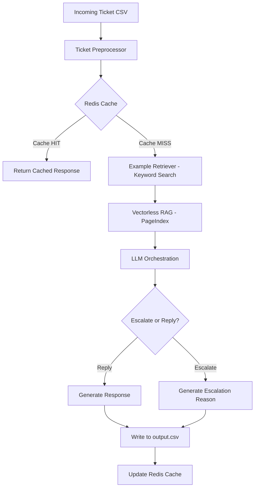
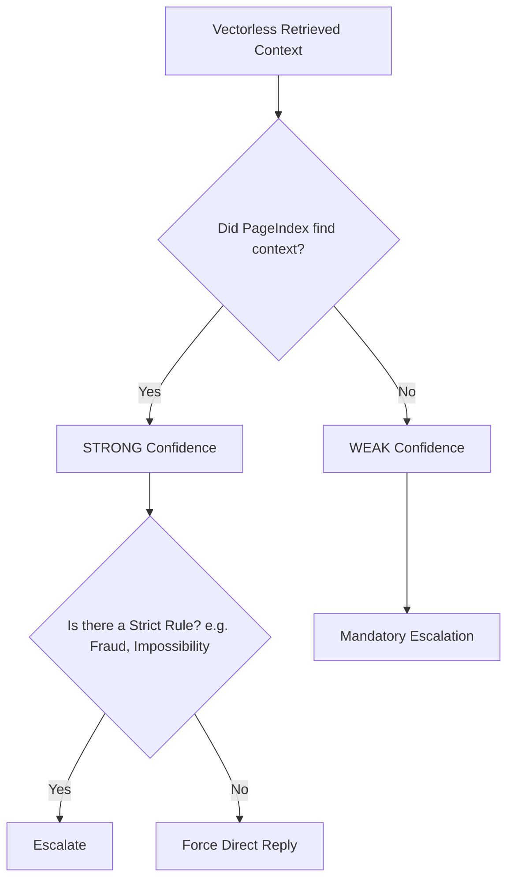

# Support Triage Agent: Orchestrator Pipeline

## 1. Project Overview
This project is a production-grade, terminal-based support triage agent developed for the **HackerRank Orchestrate Hackathon**. It processes raw incoming support tickets from companies like HackerRank, Claude, and Visa, and autonomously decides whether to reply directly to the customer or escalate the ticket to a human agent.

The solution now features a modern **Vectorless RAG** architecture utilizing **PageIndex**, moving away from traditional semantic embedding and chunking for enhanced reasoning-based retrieval and context integrity.

## 2. Problem Statement Summary
Support teams are inundated with noisy, vague, and emotionally charged tickets. The objective is to build an intelligent orchestration pipeline capable of accurately classifying incoming tickets, retrieving relevant internal documentation logically (without arbitrary chunking), referencing past solved examples to match tone and decision-making, and executing a safe, retrieval-aware escalation process.

---

## 3. System Architecture & Workflow

### Overall System Workflow


### Ticket Orchestration Flow
1. **Ticket Ingestion:** Tickets are read from `support_tickets.csv`.
2. **Preprocessing:** The `Subject` field is analyzed. If it is noisy or vague, it is heavily down-weighted, and the `Issue` (body) field is prioritized as the core semantic payload.
3. **Cache Lookup:** Redis checks if the ticket has been processed recently.
4. **Few-Shot Retrieval:** The system fetches highly relevant solved tickets from `sample_support_tickets.csv` using keyword overlap.
5. **Vectorless Retrieval:** The system retrieves relevant hierarchical sections from the indexed documentation via the **PageIndex** framework, replacing traditional FAISS embeddings.
6. **Classification:** The LLM classifies the product area and request type using the few-shot examples.
7. **Retrieval-Aware Escalation:** The system evaluates if relevant documentation was successfully found. Based on retrieval success and explicit rules, the LLM decides whether to reply or escalate.
8. **Generation:** If confident, the LLM generates a grounded response using the retrieved vectorless context.
9. **Persistence:** Output is written to `output.csv`.

---

## 4. Models Used

- **Inference LLM:** `llama3.2:latest` (via Ollama)
- **Retrieval Engine:** PageIndex Vectorless RAG Framework

**Why Vectorless RAG?**
- **No Artificial Chunking:** Preserves natural document sections (pages, headings) to maintain context and logical flow.
- **Tree-based Navigation:** Enables the system to retrieve information based on document structure rather than just raw semantic similarity.
- **Operational Simplicity:** Eliminates the need for maintaining embedding models and vector databases (like FAISS).

---

## 5. Vectorless Retrieval Pipeline

### Retrieval Pipeline Diagram


**Implementation Details:**
- **Main Support Knowledge (PageIndex):** The `data/` directory markdown files are merged by domain and submitted to PageIndex, which builds a structural tree index for highly accurate, vectorless retrieval.
- **Few-Shot Examples (Keyword Engine):** `sample_support_tickets.csv` is loaded into a fast, temporary memory array and searched via exact term overlap. This keeps tone/formatting examples strictly separate from factual knowledge.

---

## 6. Escalation Logic (Retrieval-Aware)

### Escalation Decision Flow


**Refined Behavior:**
- If retrieval is successful via PageIndex, the system prioritizes direct resolution, deliberately ignoring emotional human-support requests.
- Escalation is strictly reserved for fraud, account compromise, physical limitations, and scenarios where PageIndex returns no relevant logical sections.

---

## 7. Redis Caching

To optimize throughput and ensure idempotency:
- Every processed ticket payload is hashed and stored in Redis (port 6379).
- If the exact same ticket payload is re-submitted, the system triggers a **Cache HIT** and immediately returns the previously generated results, bypassing LLM processing.

---

## 8. Engineering & Design Decisions

- **Why Vectorless RAG?** Traditional RAG using FAISS chunks texts blindly, breaking context. PageIndex navigates the document logically as a human would, resulting in fewer hallucinations on structured docs.
- **Why prioritize the Ticket Body (`Issue`)?** Support subjects are notoriously noisy or click-bait ("HELP URGENT"). We aggressively down-weight the subject during inference to match on the actual problem.
- **Why avoid Memory Chains?** Support triage is inherently stateless. Memory chains would cause cross-ticket context bleed, misapplying context from one user's ticket to another.

---

## 9. Setup & Execution Instructions

### Prerequisites
- Install [Docker Desktop](https://www.docker.com/products/docker-desktop/)
- Install [Ollama](https://ollama.com/)
- Install [uv](https://github.com/astral-sh/uv) (Python package manager)

### 1. Pull the Model
Ensure you pull the language model locally before starting:
```bash
ollama pull llama3.2:latest
```

### 2. Start the Infrastructure (Redis)
Ensure you are in the `code/` directory.
```bash
docker compose up -d --build
```

### 3. Initialize Python Environment
Using `uv` package manager:
```bash
uv venv
source .venv/bin/activate  # On macOS/Linux
uv sync                    # Ensure dependencies from pyproject.toml are met
```
*(Ensure `pageindex` is added to your project via `uv add pageindex`)*

### 4. Index the Knowledge Base
Submit the `data/` folder into PageIndex:
Ensure you set your API key if required:
```bash
export PAGEINDEX_API_KEY="your_api_key_here"
uv run python app/indexing/indexer.py
```

### 5. Run the Orchestration Pipeline
Process the incoming tickets from `support_tickets.csv`:
```bash
uv run python app/main.py
```

### Reset & Troubleshooting Commands
To completely wipe the cache:
```bash
docker exec -it orchestrate_redis redis-cli FLUSHALL
```

---

## 10. Output Format

The pipeline generates its final results into `support_tickets/output.csv` matching the strict schema below:
```csv
issue,subject,company,response,product_area,status,request_type,justification
```
Each row independently logs the AI's final classification, whether it chose to `escalated` or `replied`, and the single-sentence justification referencing the exact internal rule that drove the decision.
