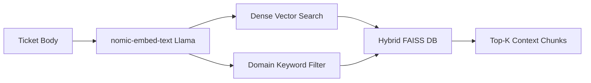
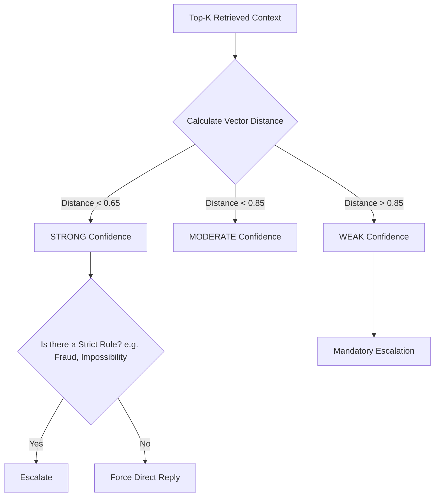

# Support Triage Agent: Orchestrator Pipeline

## 1. Project Overview
This project is a production-grade, terminal-based support triage agent developed for the **HackerRank Orchestrate Hackathon**. It processes raw incoming support tickets from companies like HackerRank, Claude, and Visa, and autonomously decides whether to reply directly to the customer or escalate the ticket to a human agent.

The solution relies entirely on the provided support corpus (`data/`) and a set of previously solved examples (`sample_support_tickets.csv`), utilizing 100% local, offline inference without external APIs.

## 2. Problem Statement Summary
Support teams are inundated with noisy, vague, and emotionally charged tickets. The objective is to build an intelligent orchestration pipeline capable of accurately classifying incoming tickets, retrieving relevant internal documentation, referencing past solved examples to match tone and decision-making, and executing a safe, retrieval-aware escalation process.

---

## 3. System Architecture & Workflow

### Overall System Workflow


### Ticket Orchestration Flow
1. **Ticket Ingestion:** Tickets are read from `support_tickets.csv`.
2. **Preprocessing:** The `Subject` field is analyzed. If it is noisy or vague, it is heavily down-weighted, and the `Issue` (body) field is prioritized as the core semantic payload.
3. **Cache Lookup:** Redis checks if the ticket has been processed recently.
4. **Few-Shot Retrieval:** The system fetches highly relevant solved tickets from an in-memory FAISS index built off `sample_support_tickets.csv`.
5. **Hybrid Search:** The system retrieves the top relevant chunks from the main FAISS vector database container, utilizing both dense vector similarity and domain-based keyword filtering.
6. **Classification:** The LLM classifies the product area and request type using the few-shot examples.
7. **Retrieval-Aware Escalation:** The system evaluates the FAISS vector distance (confidence score). Based on confidence and explicit rules, the LLM decides whether to reply or escalate.
8. **Generation:** If confident, the LLM generates a grounded response.
9. **Persistence:** Output is written to `output.csv`.

---

## 4. Models Used

- **Embedding Model:** `nomic-embed-text:latest`
- **Inference LLM:** `llama3.2:latest`

**Why Local Models?**
- **Zero Cost:** Avoids expensive API subscriptions.
- **Data Privacy:** Internal support tickets and corporate knowledge never leave the local environment.
- **Deterministic Iteration:** Faster, more predictable development cycles during the hackathon.
- **Operational Simplicity:** Avoids rate limits, network latency, and external service outages.
- **Terminal Integration:** Highly suited for headless, fast-executing terminal architectures.

---

## 5. Vector Database & Retrieval Pipeline

### Retrieval Pipeline Diagram


**Implementation Details:**
- **Main Support Knowledge (FAISS DB Container):** The `data/` directory is chunked and embedded into a containerized FAISS database exposed via a REST API. It handles the core ground truth knowledge.
- **Few-Shot Examples (In-Memory FAISS):** The `sample_support_tickets.csv` is loaded into a fast, temporary in-memory FAISS index. This ensures tone/formatting examples are not mixed with factual documentation, preventing severe LLM hallucinations during generation.

---

## 6. Escalation Logic (Retrieval-Aware)

### Escalation Decision Flow


**Refined Behavior:**
Early prototypes suffered from over-escalation (e.g., escalating simply because a user typed "I want a human agent"). The logic is now strictly **retrieval-aware**:
- If retrieval confidence is **STRONG**, the system prioritizes direct resolution, deliberately ignoring emotional human-support requests. Grounded-response-first strategy applies.
- Escalation is strictly reserved for fraud, account compromise, physical limitations (e.g., banning merchants, overriding recruiter scores), and scenarios with **WEAK** retrieval confidence.

---

## 7. Redis Caching

To optimize throughput and ensure idempotency:
- Every processed ticket payload is hashed and stored in Redis (port 6379).
- If the exact same ticket payload is re-submitted, the system triggers a **Cache HIT** and immediately returns the previously generated classification, escalation decision, and response.
- This bypasses the costly embedding and LLM inference phases entirely, turning minutes of processing into milliseconds.

---

## 8. Engineering & Design Decisions

- **Why Retrieval-Augmented Few-Shot Prompting?** Rather than injecting static examples into the prompt, dynamically retrieving the most semantically similar past ticket ensures the LLM sees highly relevant precedent for tone and routing.
- **Why Hybrid Search?** Vector similarity alone often struggles with hard domain boundaries. We combined FAISS L2 similarity with explicit domain string filtering (`claude`, `visa`, `hackerrank`) to guarantee domain isolation.
- **Why prioritize the Ticket Body (`Issue`)?** Support subjects are notoriously noisy, vague, or click-bait ("HELP URGENT"). We aggressively down-weight the subject during embedding and inference to force semantic matching on the actual problem.
- **Why avoid Memory Chains?** Support triage is inherently stateless. Implementing conversational memory chains would cause cross-ticket context bleed, leading to catastrophic hallucinations where the agent applies context from Ticket A to Ticket B.

---

## 9. Setup & Execution Instructions

### Prerequisites
- Install [Docker Desktop](https://www.docker.com/products/docker-desktop/)
- Install [Ollama](https://ollama.com/)
- Install [uv](https://github.com/astral-sh/uv) (Python package manager)

### 1. Pull the Models
Ensure you pull both models locally before starting:
```bash
ollama pull llama3.2:latest
ollama pull nomic-embed-text:latest
```

### 2. Start the Infrastructure (Redis & FAISS)
Ensure you are in the `code/` directory.
```bash
docker compose up -d --build
```

### 3. Initialize Python Environment
Using `uv` package manager:
```bash
uv venv
source .venv/bin/activate  # On macOS/Linux
uv sync                    # Ensure dependencies from pyproject.toml / requirements are met
```
*(If dependencies are missing, install them via `uv add langchain-ollama faiss-cpu redis httpx numpy pandas`)*

### 4. Index the Knowledge Base
Chunk and store the `data/` folder into the FAISS container:
```bash
uv run python indexer.py
```

### 5. Run the Orchestration Pipeline
Process the incoming tickets from `support_tickets.csv`:
```bash
uv run python main.py
```

### Reset & Troubleshooting Commands
To completely wipe the cache and vector DB for a fresh run:
```bash
docker exec -it orchestrate_redis redis-cli FLUSHALL
curl -X POST http://localhost:8000/reset
```

---

## 10. Output Format

The pipeline generates its final results into `support_tickets/output.csv` matching the strict schema below:
```csv
issue,subject,company,response,product_area,status,request_type,justification
```
Each row independently logs the AI's final classification, whether it chose to `escalated` or `replied`, and the single-sentence justification referencing the exact internal rule that drove the decision.
